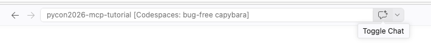
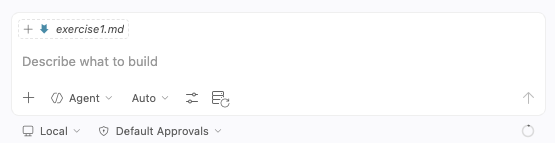

# Exercise 1: Set up your development environment and GitHub Copilot

In this exercise, you will fork the workshop repository, open your fork in a development environment, verify its Python environment, and confirm that GitHub Copilot can work with the project.

## Contents

- [Step 1: Fork the workshop repository](#step-1-fork-the-workshop-repository)
- [Step 2: Set up your development environment](#step-2-set-up-your-development-environment)
- [Step 3: Set up GitHub Copilot](#step-3-set-up-github-copilot)

## Step 1: Fork the workshop repository

1. Sign in to your GitHub account and open the [workshop repository](https://github.com/pamelafox/github-copilot-mcp-skills-workshop).
1. Select **Fork**, choose your personal account as the owner, and keep the repository name `github-copilot-mcp-skills-workshop`.
1. Select **Create fork** and wait for GitHub to open the new repository under your account.
1. Confirm that the page identifies it as forked from `pamelafox/github-copilot-mcp-skills-workshop`.

Use your fork for every setup option below. This ensures your Codespace or local
checkout already has a writable Git repository when you create the pull request
in Exercise 3.

## Step 2: Set up your development environment

Choose one option. GitHub Codespaces is recommended because the repository's development container installs Python, uv, dependencies, and the required VS Code extensions.

### Option A: GitHub Codespaces (recommended)

1. Open `https://github.com/YOUR-GITHUB-USERNAME/github-copilot-mcp-skills-workshop`.
1. Select **Code**, then **Codespaces**, then **Create codespace on main**.

   

1. Wait for the browser-based VS Code editor to fully load.

### Option B: VS Code with Dev Containers

This is a good option if you are already a user of Docker and Dev Containers, and want to avoid Python setup on your actual machine.

1. Install:

   * [VS Code](https://code.visualstudio.com/)
   * [Docker Desktop](https://www.docker.com/products/docker-desktop/)
   * [Dev Containers extension](https://marketplace.visualstudio.com/items?itemName=ms-vscode-remote.remote-containers) 

2. Clone and open your fork of the repository:

   ```bash
   git clone https://github.com/YOUR-GITHUB-USERNAME/github-copilot-mcp-skills-workshop.git
   code github-copilot-mcp-skills-workshop
   ```

3. When VS Code opens, select **Reopen in Container**. If the prompt does not appear, run **Dev Containers: Reopen in Container** from the Command Palette. Wait for the container setup to finish.

### Option C: Local environment

1. Install:

   * [Git](https://git-scm.com/)
   * Python 3.12 or later
   * [uv](https://docs.astral.sh/uv/getting-started/installation/)
   * [VS Code](https://code.visualstudio.com/), [GitHub Copilot CLI](https://docs.github.com/en/copilot/concepts/agents/about-copilot-cli) or [GitHub Copilot app](https://github.com/github/app)

2. Clone your fork of the repository:

   ```bash
   git clone https://github.com/YOUR-GITHUB-USERNAME/github-copilot-mcp-skills-workshop.git
   cd github-copilot-mcp-skills-workshop
   ```

3. Install Python dependencies for the example program:

   ```
   uv sync
   ```

## Step 3: Set up GitHub Copilot

Choose the Copilot environment you will use for the workshop.

### GitHub Copilot in VS Code or Codespaces

1. Open Copilot Chat using the chat icon in the VS Code title bar.

   

1. Sign in and accept the usage terms if prompted.
1. Select **Agent** mode in the chat input.

   

1. Ask `Which workspace folder is currently open?` and confirm the response names this repository.
1. Ask `What is the upstream repository for this fork?` and confirm the response identifies `pamelafox/github-copilot-mcp-skills-workshop`. 

### GitHub Copilot CLI

1. Install Copilot CLI by following the [installation guide](https://docs.github.com/en/copilot/how-tos/copilot-cli/set-up-copilot-cli/install-copilot-cli). If you're in Codespaces, use the `curl` command on that page.
1. From the repository root, run `copilot` and sign in if prompted.
1. Ask `Which repository am I currently working in?` and confirm the response.
1. Ask `What is the upstream repository for this fork?` and confirm the response identifies `pamelafox/github-copilot-mcp-skills-workshop`.

### GitHub Copilot app

1. Install and open the [GitHub Copilot app](https://github.com/github/app).
1. From **Projects**, select **+**, then **Add GitHub repository**.
1. Add `https://github.com/YOUR-GITHUB-USERNAME/github-copilot-mcp-skills-workshop`.
1. Ask `Which repository is attached to this session?` and confirm the response.
1. Ask `What is the upstream repository for this fork?` and confirm the response identifies `pamelafox/github-copilot-mcp-skills-workshop`.